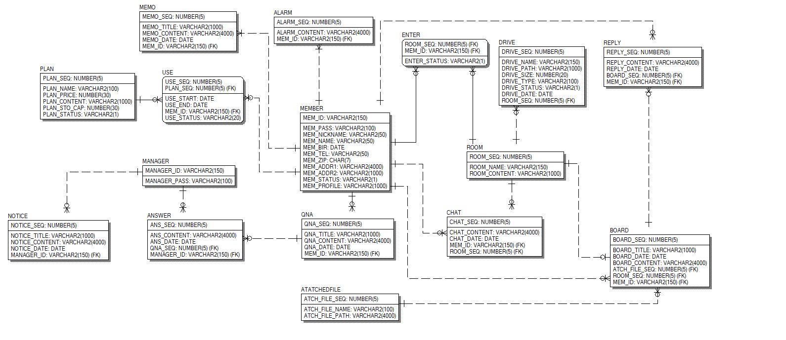
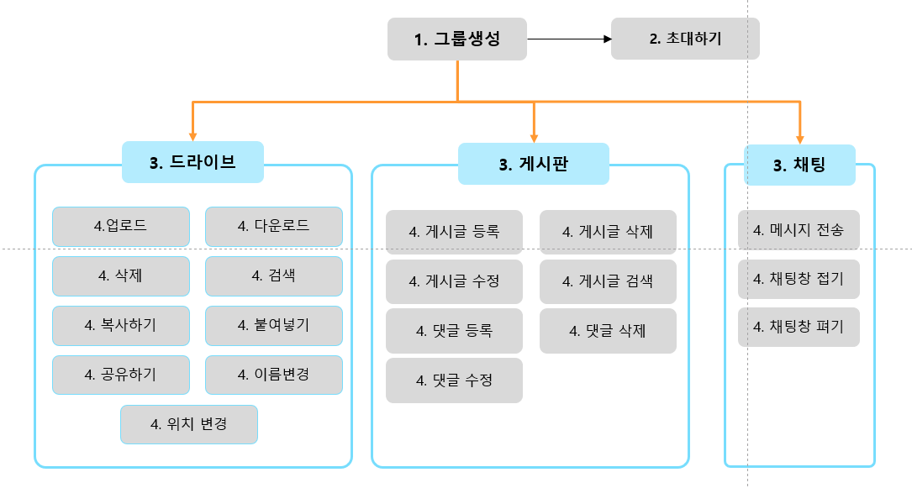
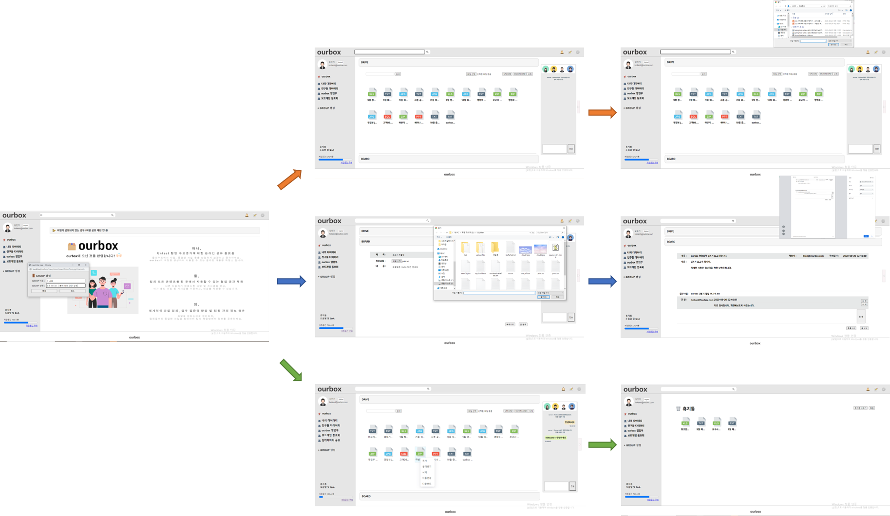

# :file_folder: ourbox (파일 저장/공유 서비스)

### 1. introduce

팀의 모든 콘텐츠를 한 곳에서 사용할 수 있는 것은 물론, 체계적인 파일 정리, 업무 집중력 향상 및 **팀원 간의 정보 공유를 위한 서비스.**  
- 프로젝트는 가입된 회원 중 일반회원과 스토리지 구독 회원으로 구분되고, 권한이 있는 관리자로 사용자가 나뉜다.  
- 일반 회원 : 드라이브 서비스 이용, 그룹핑( 파일 공유, 채팅, 초대,게시글 작성), 스토리지 요금제 구매, QnA 작성  
- 구독 회원 : 공통기능 이용, 확장된 저장공간 이용  
- 관리자 : 스토리지 요금제 관리, QnA 게시판 관리, 공지 게시판 관리, 회원 관리  

### 2. schedule
- 주제선정 및 설계 : 2020.09.03 ~ 2020.09.11
- 기능 구현 : 2020.09.12 ~ 2020.09.19
- 테스트 및 유지보수 : 2020.09.20 ~ 2020.09.21

 

## :bulb: Technology stack

### 1. Front-end
  - HTML, Css, JavaScript, jQuery

### 2. Back-end 
  - java, jsp, servlet, oracle
  
### 3. 협업도구
  - SVN
  
### 4. API
  - java email, CAPTCHA
  
 

## :books: Modeling

 

## :runner: Function
### 1. 회원기능
1. 회원가입 및 탈퇴
2. **구글캡챠API**
3. **이메일 인증API**
4. 로그인&로그아웃
5. 아이디 찾기&비밀번호 찾기
6. 내 프로필 조회 및 수정
7. 모든 그룹의 파일을 검색할 수 있는 **통합검색**

### 2. 메모기능
1. 메모 조회 및 작성, 수정, 삭제

### 3. 알람기능
1. 알람 조회
2. 알람 개별 지우기 및 전체 지우기

### 4. 요금제기능
1. 요금제 및 결제 내역 조회
2. 요금제 변경/해지

### 5. 그룹기능
1. 소속된 그룹 목록 조회
2. 새로운 **그룹 생성**
3. **그룹 내 초대하기**
4. **그룹 내 드라이브/게시판 이용**

### 6. 드라이브기능
1. 드라이브 내 파일 검색
2. **드라이브 내 파일 업로드 및 다운로드**
3. 드라이브 내 파일 삭제
4. 우클릭 기능을 이용한 파일 복사, 붙여넣기, 이름변경, 다운로드, 삭제
5. 드라이브 사용량에 따른 게이지 표시

### 7. 휴지통기능
1. 휴지통 파일 목록 조회
2. 삭제한 파일 휴지통 보관
3. 파일 영구삭제를 위한 휴지통 비우기
4. **파일 복원하여 이전 위치로 복원**

### 8. 게시판기능
1. 글 조회 및 작성, 수정, 삭제
2. 댓글 조회 및 작성, 수정, 삭제
3. 파일 첨부
4. **PDF 출력**
5. 검색과 페이징 처리

### 9. 관리자기능
1. 요금제 별 회원 목록 조회
2. 요금제 등록 및 삭제
3. 공지게시판 관리 및 글쓰기
4. QnA게시판 답변 작성

### 10. 채팅기능
1. 그룹 구성원 목록 조회
2. 그룹 내 구성원들끼리 **채팅**

 

## :star: Main Function

### 1. 프로세스 흐름도
 

### 2. 그룹생성 -> 파일드라이브 / 게시판 / 채팅

 

## :page_facing_up: Document
&nbsp;&nbsp;&nbsp;  :link: [https://www.notion.so/OURBOX/document](https://www.notion.so/Document-fe68355447f04011a58bd444296fff20)

 

## :paperclip: Reference
&nbsp;&nbsp;&nbsp; :link: [https://www.notion.so/OURBOX](https://www.notion.so/OURBOX-91de8767470146659b5a13eaac038a3d)

 
  
## :family: Developer
- 홍정기 : https://github.com/JEOLKI  
- 강태경 : https://github.com/TaekyeongKang  
- 이명호 : https://github.com/seaweedy  
- 이동주 : https://github.com/ddongjju
- 최윤지 : https://github.com/OZYEYO

